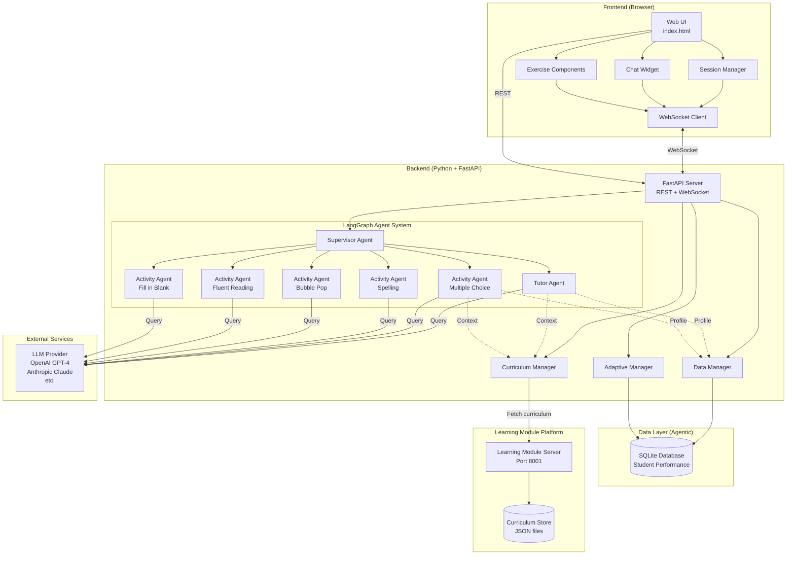

# Agentic Learning System Architecture

## System Overview

The agentic learning system is a **separate, independent platform** that provides intelligent tutoring and adaptive difficulty services to the learning module. It maintains strict separation of concerns:

- **Learning Module Platform**: Owns all curriculum, content, and game settings
- **Agentic Platform**: Provides AI tutoring, adaptive difficulty recommendations, and performance tracking

The agentic platform imports curriculum data on-demand and never stores or manages educational content directly.

## Architecture Diagram



## Component Details

### Frontend Components

#### Session Manager

- **Purpose**: Manages session lifecycle and WebSocket connection
- **Responsibilities**:
  - Initialize session on student login/registration
  - Maintain WebSocket connection
  - Route messages between UI and backend
  - Handle session cleanup on logout

#### Chat Widget

- **Purpose**: Conversational interface with tutor agent
- **Features**:
  - Collapsible panel
  - Message history
  - Real-time streaming responses
  - Multi-modal support (text, future: audio/video)

#### Exercise Components (Modified)

- **Changes Required**:
  - Add hint button UI
  - Send game events to agent (errors, completions)
  - Apply recommended tuning_settings
  - Display agent feedback

### Backend Components

#### FastAPI Server

- **REST Endpoints**:
  - `POST /api/session/init` - Initialize learning session
  - `POST /api/session/end` - Close session and save state
  - `POST /api/activity/start` - Begin activity with agent
  - `POST /api/activity/end` - Submit results and get feedback
  - `GET /api/student/{id}/profile` - Retrieve student data
  - `GET /api/student/{id}/history` - Get performance history

- **WebSocket Endpoint**:
  - `WS /ws/{session_id}` - Real-time bidirectional communication

#### LangGraph Agent System

##### Supervisor Agent

- **Role**: Orchestrates between tutor and activity agents
- **Decisions**:
  - Route messages to appropriate agent
  - Manage agent state transitions
  - Coordinate context sharing

##### Tutor Agent

- **Role**: Persistent learning companion for the session
- **Context**:
  - Full curriculum module content
  - Student profile and history
  - Session conversation history
- **Capabilities**:
  - Explain vocabulary concepts
  - Suggest appropriate activities
  - Provide encouragement
  - Answer questions about lesson content
- **Personality**: Friendly, pirate-themed, grade 3 appropriate

##### Activity Agents

- **Specialization**: One per exercise type
- **Context**:
  - Activity-specific curriculum
  - Current question/problem
  - Student's performance in this activity
  - Recommended tuning_settings
- **Capabilities**:
  - Provide contextual hints
  - Explain errors
  - Adjust difficulty dynamically
  - Generate feedback

#### Data Manager

- **Purpose**: Database operations and data persistence
- **Functions**:
  - CRUD operations for students, sessions, attempts
  - Store chat message history
  - Retrieve performance analytics

#### Adaptive Manager

- **Purpose**: Intelligence layer for difficulty adjustment
- **Algorithm**:

  ```python
  def calculate_tuning_settings(student_history, activity_type, curriculum):
      # Analyze recent performance
      recent_attempts = get_recent_attempts(student_history, activity_type, n=5)
      avg_accuracy = calculate_average_accuracy(recent_attempts)
      
      # Calculate vocabulary mastery
      word_mastery = analyze_word_level_performance(recent_attempts)
      
      # Determine difficulty tier
      if avg_accuracy > 0.85:
          difficulty = "hard"
          speed_multiplier = 1.5
      elif avg_accuracy > 0.65:
          difficulty = "moderate"
          speed_multiplier = 1.0
      else:
          difficulty = "easy"
          speed_multiplier = 0.7
      
      # Generate activity-specific tuning
      return generate_tuning_settings(
          activity_type, 
          difficulty, 
          speed_multiplier,
          word_mastery
      )
  ```

- **Outputs**: Tuning_settings JSON for each activity

#### Curriculum Manager

- **Purpose**: Fetch and cache curriculum data from Learning Module Platform
- **Responsibilities**:
  - Request curriculum data via API or shared filesystem
  - Cache curriculum temporarily for session duration
  - Filter vocabulary by mastery level
  - Provide relevant content for agent prompts
- **Important**: Does NOT store or manage curriculum - only fetches and caches

## Platform Separation

### Learning Module Platform (Existing)

**Port**: 8001 (or file-based)

**Responsibilities**:

- Store and serve all curriculum modules (JSON files)
- Define exercise types and their settings
- Manage game assets (images, audio, etc.)
- Provide activity configuration options
- Own all educational content

**API Endpoints** (if exposing via HTTP):

```text
GET /curriculum/{module_id}
GET /curriculum/{module_id}/vocabulary
GET /curriculum/{module_id}/narrative
GET /curriculum/{module_id}/exercise-settings
```

### Agentic Platform (New)

**Port**: 8000

**Responsibilities**:

- Track student performance and history
- Provide AI tutoring and hints
- Calculate adaptive difficulty recommendations
- Manage agent conversations
- Store only performance data, not curriculum

**Data Stored**:

- Student profiles and authentication
- Activity attempt history
- Chat message logs
- Performance analytics

### Data Layer

#### Agentic Platform Database Schema

```sql
-- Students table
CREATE TABLE students (
    student_id TEXT PRIMARY KEY,  -- UUID
    name TEXT NOT NULL,
    grade_level INTEGER DEFAULT 3,
    created_at TIMESTAMP DEFAULT CURRENT_TIMESTAMP
);

-- Sessions table
CREATE TABLE sessions (
    session_id TEXT PRIMARY KEY,  -- UUID
    student_id TEXT NOT NULL,
    start_time TIMESTAMP DEFAULT CURRENT_TIMESTAMP,
    end_time TIMESTAMP,
    module_id TEXT NOT NULL,
    FOREIGN KEY (student_id) REFERENCES students(student_id)
);

-- Activity attempts table
CREATE TABLE activity_attempts (
    attempt_id TEXT PRIMARY KEY,  -- UUID
    session_id TEXT NOT NULL,
    student_id TEXT NOT NULL,
    date TIMESTAMP DEFAULT CURRENT_TIMESTAMP,
    module TEXT NOT NULL,
    activity TEXT NOT NULL,
    score INTEGER NOT NULL,
    total INTEGER NOT NULL,
    difficulty TEXT NOT NULL,
    tuning_settings JSON NOT NULL,  -- Activity-specific parameters
    item_results JSON NOT NULL,     -- Per-item success/failure
    FOREIGN KEY (session_id) REFERENCES sessions(session_id),
    FOREIGN KEY (student_id) REFERENCES students(student_id)
);

-- Chat messages table
CREATE TABLE chat_messages (
    message_id TEXT PRIMARY KEY,  -- UUID
    session_id TEXT NOT NULL,
    agent_type TEXT NOT NULL,  -- 'tutor' or activity name
    sender TEXT NOT NULL,      -- 'student' or 'agent'
    message TEXT NOT NULL,
    timestamp TIMESTAMP DEFAULT CURRENT_TIMESTAMP,
    FOREIGN KEY (session_id) REFERENCES sessions(session_id)
);

-- Indexes for performance
CREATE INDEX idx_attempts_student ON activity_attempts(student_id, date DESC);
CREATE INDEX idx_attempts_session ON activity_attempts(session_id);
CREATE INDEX idx_messages_session ON chat_messages(session_id, timestamp);
```

## Data Flow

### Session Initialization Flow

1. Frontend: User logs in or registers
2. Frontend → Agentic API: `POST /api/session/init` with student info
3. Agentic Platform: Generate session_id (UUID)
4. Agentic Platform: Load student profile from database
5. **Agentic Platform → Learning Module**: Request curriculum data for module
6. **Learning Module → Agentic Platform**: Return curriculum JSON
7. Agentic Platform: Initialize LangGraph with student context + curriculum
8. Agentic Platform: Calculate available activities and tuning_settings
9. Agentic Platform → Frontend: Session data + tutor greeting
10. Frontend: Open WebSocket connection to Agentic Platform
11. Frontend: Display chat widget with greeting

### Activity Start Flow

1. Student selects activity
2. Frontend → Agentic API: `POST /api/activity/start`
3. Agentic Platform: Query student history for performance data
4. Agentic Platform: Calculate recommended tuning_settings
5. **Agentic Platform → Learning Module**: Request activity-specific curriculum
6. **Learning Module → Agentic Platform**: Return vocabulary and content for activity
7. Agentic Platform: Initialize activity agent with curriculum context
8. Agentic Platform → Frontend: Tuning recommendations + agent introduction
9. **Frontend → Learning Module**: Apply tuning to activity (managed by Learning Module)
10. Frontend: Display agent message, start activity

### Real-time Interaction Flow (During Activity)

1. Game Event: Student makes error (in Learning Module)
2. Frontend → Agentic Platform: WebSocket message with error context
3. Agentic Platform: Route to activity agent
4. Agent: Analyze error using cached curriculum data
5. Agent: Generate hint/feedback referencing curriculum definitions
6. Agentic Platform → Frontend: Agent response via WebSocket
7. Frontend: Display hint in chat or overlay

### Activity End Flow

1. Activity completes (in Learning Module)
2. Frontend → Agentic Platform: `POST /api/activity/end` with results
3. Agentic Platform: Store attempt in performance database (with UUID)
4. Agentic Platform: Update student performance profile
5. Agentic Platform: Agent analyzes performance using curriculum context
6. Agentic Platform → Frontend: Feedback + next recommendations
7. Frontend: Display results + agent feedback
8. Agentic Platform: Update tutor agent context with results
9. **Frontend → Learning Module**: Update progress/unlock state (Learning Module manages)

## Tuning Settings Specification

### Multiple Choice

```json
{
  "difficulty": "easy|medium|hard",
  "num_questions": 5|10|15|20,
  "num_choices": 3|4|5,
  "time_limit": null|60|120
}
```

### Fill in the Blank

```json
{
  "difficulty": "easy|moderate",
  "num_questions": 5|10|15,
  "word_bank_size": "required_only|all_vocabulary"
}
```

### Spelling

```json
{
  "difficulty": "easy|medium|hard",
  "num_questions": 5|10|15|20,
  "hint_availability": "always|after_1_attempt|after_2_attempts|never"
}
```

### Bubble Pop

```json
{
  "difficulty": "easy|moderate|hard",
  "bubble_speed": 0.5-2.0,
  "error_rate": 0.0-0.5,
  "game_mode": "correct_only|incorrect_only|both",
  "initial_delay": 1000-3000,
  "min_delay": 300-1000,
  "ramp_rate": 25-100
}
```

### Fluent Reading

```json
{
  "difficulty": "easy|moderate|hard",
  "reading_speed_wpm": 60-120,
  "variant_type": "vocab|spelling|all",
  "time_multiplier": 1.0-2.0,
  "checkpoint_frequency": "low|medium|high"
}
```

## Agent Prompts

### Tutor Agent System Prompt

```text
You are a friendly pirate-themed learning tutor helping a 3rd grade student.

CONTEXT:
- Current Module: {module_id}
- Curriculum: {vocabulary_list}
- Student Profile:
  * Name: {student_name}
  * Overall Mastery: {mastery_percentage}%
  * Strong Words: {strong_words}
  * Needs Practice: {weak_words}
  * Recent Performance: {recent_scores}

YOUR ROLE:
- Guide the student through the learning module with encouragement
- Explain vocabulary words using simple, grade-appropriate language
- Suggest activities based on their current level
- Answer questions about the pirate story and vocabulary
- Celebrate successes and provide supportive feedback on mistakes
- Use pirate-themed language occasionally but keep it fun and clear

GUIDELINES:
- Keep responses brief (2-3 sentences)
- Use simple words and short sentences
- Be encouraging and positive
- Reference the pirate story context when explaining words
- Don't give direct answers - guide students to discover

AVAILABLE ACTIVITIES:
{unlocked_activities}

Current conversation:
```

### Activity Agent Prompt Template

```text
You are an educational assistant helping with the {activity_name} exercise.

CURRENT EXERCISE:
- Activity: {activity_type}
- Difficulty: {difficulty}
- Current Question: {current_question}
- Student Answer: {student_answer}
- Correct Answer: {correct_answer}

STUDENT CONTEXT:
- Recent accuracy in this activity: {recent_accuracy}%
- Words mastered: {mastered_words}
- Words needing practice: {struggling_words}

YOUR TASK:
When student makes an error:
1. Identify the specific misconception
2. Provide a hint that guides without giving the answer
3. Reference the curriculum definition or story context
4. Keep it brief and encouraging

When student requests help:
1. Assess what they might be confused about
2. Provide progressively more explicit hints
3. Eventually guide to the answer if needed

Example error response:
"Hmm, that's close! Remember, a {word} is {simplified_definition}. 
In the pirate story, {relevant_context}. Try again!"
```

## Security Considerations

### Authentication

- Student IDs should be authenticated via secure session tokens
- WebSocket connections must be validated against active sessions

### Data Privacy

- Encrypt sensitive student data at rest
- Use HTTPS for all API communication
- WSS (secure WebSocket) for real-time communication
- Implement data retention policies

### Rate Limiting

- Limit API requests per session
- Throttle LLM queries to manage costs
- Implement fallback responses if LLM unavailable

## Scalability Considerations

### Current (Demo)

- SQLite database (file-based)
- Single server instance
- Local LLM queries

### Production

- PostgreSQL or MongoDB for data
- Redis for session management
- Multiple API server instances with load balancer
- Message queue (RabbitMQ/Kafka) for async processing
- CDN for static assets
- LLM response caching
- Monitoring and logging (Prometheus, Grafana)

## Technology Stack

### Backend

- **Language**: Python 3.11+
- **Framework**: FastAPI 0.104+
- **Agent Framework**: LangGraph 0.0.20+
- **LLM Integration**: langchain-openai 0.0.2+
- **Database**: SQLite (dev), PostgreSQL (prod)
- **WebSocket**: websockets 12.0+
- **ORM**: SQLAlchemy 2.0+
- **Validation**: Pydantic 2.5+

### Frontend

- **Base**: Vanilla JavaScript (existing)
- **WebSocket**: Native WebSocket API
- **New Libraries**:
  - Marked.js (for markdown rendering in chat)
  - DOMPurify (for XSS protection)

### Development

- **Testing**: pytest, pytest-asyncio
- **Linting**: ruff, black
- **Type Checking**: mypy
- **API Documentation**: OpenAPI (auto-generated by FastAPI)

## Performance Targets

- **Session Init**: < 2 seconds
- **Agent Response**: < 3 seconds (90th percentile)
- **WebSocket Latency**: < 100ms
- **Database Queries**: < 50ms
- **Concurrent Sessions**: 100+ (demo), 10,000+ (production)

## Monitoring and Observability

### Metrics to Track

- Agent response times
- LLM token usage and costs
- Student engagement (messages per session)
- Activity completion rates
- Error rates by component
- WebSocket connection stability

### Logging

- Structured JSON logs
- Agent decision traces
- Student interaction events
- Error tracking and alerting

## Future Enhancements

### Phase 2

- Voice interaction (text-to-speech and speech-to-text)
- Multi-modal content (images, video)
- Teacher dashboard for monitoring
- Parent reports

### Phase 3

- Multi-student sessions (peer learning)
- Advanced analytics and recommendations
- Curriculum creation tools
- Mobile app versions

### Phase 4

- Integration with school LMS systems
- Standardized assessment tracking
- Multi-language support
- Accessibility improvements (screen readers, dyslexia-friendly modes)
